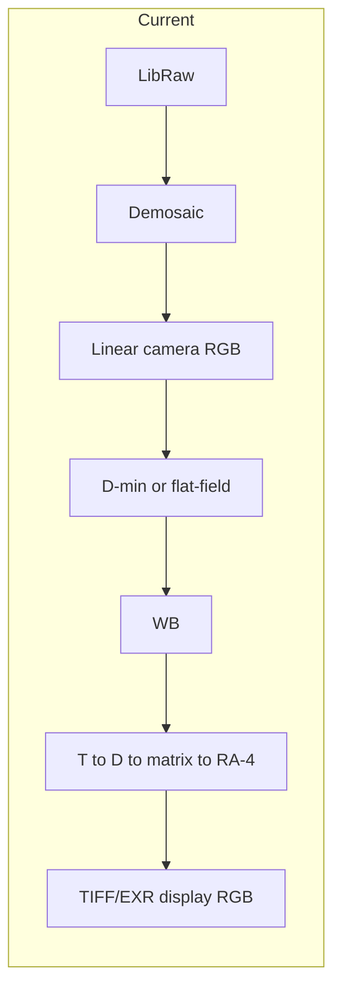
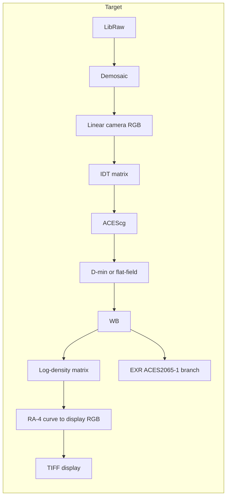

# Internal color space update (ACES hybrid)

## Summary

This document describes a hybrid approach to using ACES in the C-41 RAW pipeline: treat ACES purely as a highly accurate mathematical container and bypass its display rendering entirely. The pipeline converts linear camera RGB to **ACEScg** via an IDT (Input Device Transform), then applies D-min/flat-field, white balance, and the existing log-density + RA-4 curve in ACEScg space. Output to display is done by mapping ACEScg directly to standard display RGB (e.g. sRGB) with the custom RA-4 curve—no ACES RRT/ODT. An optional export branch writes **ACES2065-1** EXR for VFX/archival.

---

## Current vs target pipeline

### Current pipeline

- Working space is implicit **linear camera RGB** (normalized [0,1] after demosaic).
- Order: LibRaw → Demosaic → Linear camera RGB → D-min or flat-field → WB → T→D→matrix→RA-4 → TIFF/EXR (display RGB).
- `src/lib.rs`: `process_files` loads RAW, demosaics, applies D-min/flat, WB, then either curve (T→D→matrix→RA-4) or no-curve; writes TIFF and optionally EXR (display-referred u16 or f32).
- `src/curve.rs`: density from transmittance, 3×3 matrix, RA-4 S-curve; output is display u16.
- `src/exr_export.rs`: writes RGB f32 or u16→f32, no color space tag.

### Target pipeline

- **IDT**: 3×3 (or 3×4) matrix from linear camera RGB → **ACEScg** (per camera or default).
- **D-min / flat-field / WB**: applied in **ACEScg** (same math, different space).
- **Log-density + 3×3 matrix**: computed in **ACEScg** (T → D → M → RA-4); output is display-referred.
- **EXR branch**: export **ACES2065-1** (scene-referred) for VFX/archival, after WB (linear ACEScg transmittance → convert to ACES2065-1).
- **RA-4 curve**: applied to ACEScg data, mapping directly to **standard display RGB** (e.g. sRGB), bypassing ACES RRT/ODT.

---

## Pipeline steps (target)

1. **LibRaw** → linear camera RGB (unchanged).
2. **IDT** → convert linear camera RGB to **ACEScg** (3×3 matrix, configurable/default).
3. **D-min or flat-field** → applied in ACEScg (same division/neutralization as today).
4. **White balance** → applied in ACEScg (per-channel gains).
5. **(Optional) EXR branch** → ACEScg linear transmittance → convert to ACES2065-1 → write EXR (scene-referred, for VFX/archival). Optional second EXR or flag (e.g. `--export-aces-exr`).
6. **Log-density + 3×3 matrix** → in ACEScg: T → D = -log10(T), D_out = M·D_in, then RA-4 S-curve.
7. **RA-4 curve** → ACEScg → standard display RGB (e.g. sRGB); no ACES RRT/ODT.
8. **TIFF/EXR (display)** → as today (u16 or f32 display-referred).

---

## Design choices

1. **IDT source**: Start with a configurable 3×3 in options/profile (e.g. identity or single “generic camera”); later add per-camera IDT presets from file.
2. **Color calibration matrix**: Density and matrix are in ACEScg. Existing profiles were solved in camera density space; for backward compatibility, convert existing matrix into ACEScg (e.g. M_aces = T · M_cam · T_inv with T = camera→ACEScg in density). Re-solving calibration using ACEScg reference densities is an optional refinement.
3. **EXR branch point**: Export raw ACES2065-1 EXR **after WB** (linear ACEScg transmittance converted to ACES2065-1). This is the natural scene-referred archival point. Optional second EXR or a flag (e.g. `--export-aces-exr`) to enable it.
4. **ACEScg ↔ ACES2065-1**: Use standard 3×3 (AP1 linear → AP0 linear). Constants are public (ACES documentation); no new dependency strictly required.

---

## Implementation outline

- **New module or section: IDT** — 3×3 matrix (loadable/default), applied after demosaic to get linear camera RGB → ACEScg.
- **New module or section: ACES** — ACEScg ↔ ACES2065-1 3×3; no RRT/ODT. Used for the EXR branch and any future ACES tagging.
- **`src/lib.rs`**: Insert IDT after demosaic; run D-min, flat-field, and WB in ACEScg; add EXR branch (ACEScg → ACES2065-1, write EXR) and keep existing curve → TIFF/EXR path.
- **`src/curve.rs`**: Input remains “linear transmittance” but now in ACEScg; no API change if the pipeline interface is unchanged.
- **`src/exr_export.rs`**: Add path to write ACES2065-1 EXR (and optionally tag color space in EXR if the crate supports it).
- **Options/CLI**: e.g. `--idt-matrix`, `--export-aces-exr`, or GUI checkboxes for “Use ACEScg” and “Export ACES2065-1 EXR”.

---

## Implementation checklist

Check off each step as you complete it. Phases can be done in order; within a phase, steps are roughly sequential.

### Phase 1: ACES and IDT modules

- [x] **1.1** Add `src/aces.rs` (or `src/color_space/aces.rs`): define ACEScg ↔ ACES2065-1 3×3 matrix (AP1 linear → AP0 linear; constants from ACES docs). Expose e.g. `linear_acescg_to_aces2065_1(image: &mut Array3<f32>)` or a function that returns a new array.
- [x] **1.2** Add IDT support: new module or section in lib (e.g. `src/idt.rs` or in `src/aces.rs`): 3×3 matrix type, default identity. Expose e.g. `apply_idt(image: &mut Array3<f32>, matrix: &[[f32;3];3])`.
- [x] **1.3** Add `PipelineOptions` fields: `use_acescg: bool` (default false for backward compat), `idt_matrix: [[f32;3];3]` (default identity), `export_aces_exr: bool`. Ensure CLI and GUI can set these (or add in a later phase).

### Phase 2: Pipeline integration (lib.rs)

- [x] **2.1** In `process_files`, after demosaic: if `use_acescg`, apply IDT to convert linear camera RGB → ACEScg. Then run D-min/flat-field and WB as today (now in ACEScg).
- [x] **2.2** Add EXR branch: if `export_aces_exr`, take the image after WB (linear ACEScg), convert to ACES2065-1, write to e.g. `{stem}_aces2065-1.exr` (or a dedicated path). Do not apply curve to this branch.
- [x] **2.3** Keep existing curve path: input is still "linear transmittance" (now in ACEScg when `use_acescg`); curve output remains display RGB. TIFF/EXR (display) unchanged.
- [x] **2.4** In `process_one_to_preview`, apply the same logic: optional IDT → ACEScg, then D-min/flat, WB, then curve for preview (no ACES EXR branch needed for preview).

### Phase 3: EXR and options

- [x] **3.1** In `src/exr_export.rs`, add a path or helper to write ACES2065-1 EXR (same f32 write as today; optionally set color space in EXR metadata if the `exr` crate supports it).
- [x] **3.2** CLI: add `--use-acescg`, `--idt-matrix` (9 floats or path to file), `--export-aces-exr`. Parse and pass into `PipelineOptions`.
- [x] **3.3** GUI: add checkboxes "Use ACEScg" and "Export ACES2065-1 EXR"; optional IDT matrix load or 9 inputs. Wire to `PipelineOptions` and refresh preview when toggled.

### Phase 4: Calibration and docs

- [ ] **4.1** Document or implement calibration matrix conversion for ACEScg: when `use_acescg`, either convert existing profile matrix (M_aces = T · M_cam · T_inv) or document that new calibrations should be solved in ACEScg. If converting, add a small helper or apply in curve pipeline when in ACEScg mode.
- [ ] **4.2** Update README (and this doc if needed): mention ACES hybrid option, IDT, and ACES2065-1 EXR export. Trim or reference the duplicate "Future work" ACES paragraph in README.

---

## Calibration

The existing 3×3 density matrix remains; density and matrix are calculated in **ACEScg**. Existing calibration profiles (solved in camera space) should be interpreted or converted for ACEScg: either apply the camera→ACEScg transform to the density matrix (M_aces = T · M_cam · T_inv) so that the same visual result is achieved, or document that new calibrations can be solved with ACEScg reference densities for consistency.

---

## Future work

- Optional sRGB ICC embedding on TIFF (display output).
- Optional EXR color space tags (e.g. ACES2065-1 in EXR metadata).
- Per-camera IDT presets (load from file or profile).
